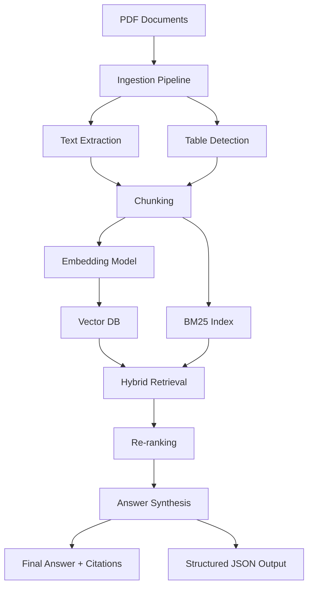

# Multimodal RAG + Enterprise Document Analysis

## Overview

This project implements a production-ready proof-of-concept for a **Multimodal Retrieval-Augmented Generation (RAG) system** designed for enterprise document analysis.

The system ingests unstructured and structured documents (PDFs containing text, tables, and images), builds a hybrid knowledge base, retrieves relevant information with explainability, and generates grounded outputs with citations and structured insights.

It is aligned with the case study requirements and designed for realistic enterprise deployment scenarios. fileciteturn5file0

---

## System Architecture



---

## Key Capabilities

- Ingests multiple PDFs (reports, product specifications, table-heavy documents)
- Extracts text and detects table-like structures
- Builds a hybrid retrieval system:
  - BM25 (keyword-based)
  - Dense embeddings (semantic)
- Applies reranking using a cross-encoder
- Generates grounded outputs with citations
- Produces structured JSON insights

---

## Pipeline Breakdown

### 1. Ingestion
- PDFs are parsed using PyMuPDF
- Each page is stored with metadata and citation (e.g., file.pdf#page=3)

### 2. Modality Detection (Tables vs Text)
- Table-heavy pages are detected using:
  - spacing patterns
  - numeric density
  - alignment heuristics
- These pages are treated differently during chunking

> Note: In production, this can be extended using tools like Camelot or pdfplumber for precise table extraction.

### 3. Chunking Strategy
- Text → smaller chunks with overlap
- Tables → larger chunks to preserve row relationships

### 4. Hybrid Retrieval
- BM25 → captures keyword relevance
- Dense embeddings → capture semantic meaning
- Combined using Reciprocal Rank Fusion (RRF)

### 5. Reranking
- Cross-encoder model reorders retrieved chunks
- Improves precision by focusing on query-specific relevance

### 6. Hallucination Prevention
- Only retrieved chunks are used
- All outputs include citations
- System avoids generating unsupported claims

---

## Output Format

```json
{
  "summary": "...",
  "key_findings": [...],
  "numerical_data": [...],
  "risk_flags": [...],
  "domain_insights": [...],
  "citations": [...]
}
```

---

## Evaluation Examples

The system is validated by:

- Running queries across multiple documents
- Inspecting retrieved chunks
- Verifying citation correctness
- Checking numerical extraction
- Validating risk detection

---

## Running the System

### 1. Install Dependencies

```bash
pip install pymupdf sentence-transformers rank-bm25 qdrant-client numpy
```

### 2. Prepare Data

```
data/
├── report.pdf
├── product_spec.pdf
└── financial_table.pdf
```

### 3. Run

```bash
python rag_pipeline.py --data-dir data --query "Summarize key findings, extract numerical data, and identify risks"
```

---

## Enterprise & Scalability Considerations

- Designed for deployment inside Kubernetes clusters
- Supports self-hosted models for data privacy
- Vector DB (Qdrant) can be scaled or replaced with distributed alternatives
- Suitable for on-prem enterprise environments

---

## Limitations

- Table extraction is heuristic-based
- Image understanding not yet implemented
- OCR not included for scanned PDFs

---

## Future Improvements

- Add structured table parsing (Camelot)
- Add multimodal image embeddings
- Improve evaluation metrics
- Add API layer for production use

---

## Conclusion

This system demonstrates a robust, explainable, and scalable approach to enterprise document analysis using hybrid RAG. It is designed to handle real-world variability in documents while maintaining grounded, reliable outputs.